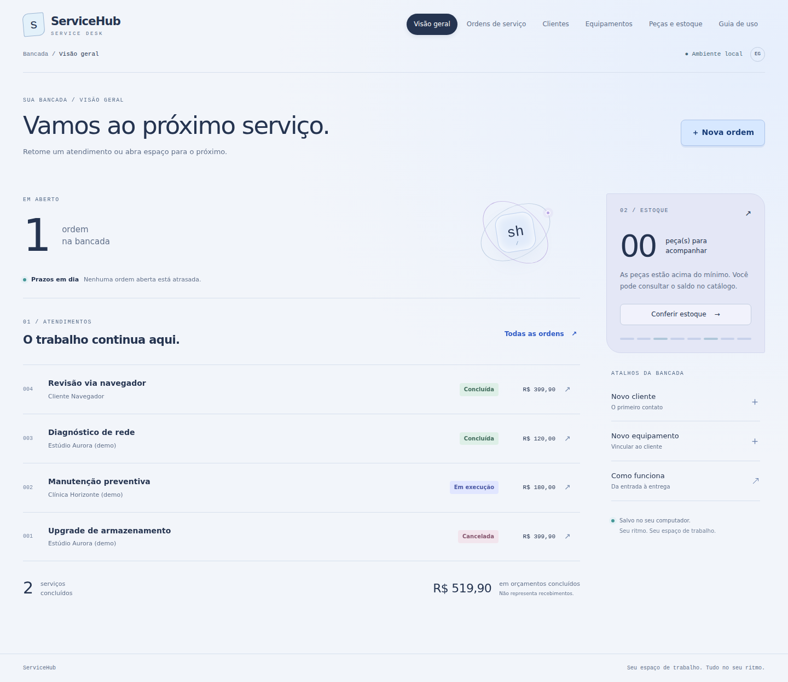

# ServiceHub · Gestão de assistência técnica

[](https://github.com/Gmerick/java-servicehub/actions/workflows/ci.yml)

Aplicação de portfólio em **Java 17 + Spring Boot**, com interface web em português, banco persistente e fluxo de ordens de serviço. Organiza clientes, equipamentos, orçamento, execução e estoque em uma aplicação local.



[Ver a interface no celular](docs/screenshots/mobile.png). Capturas reais geradas pelos testes de navegador.

## O que é possível fazer

- Cadastrar clientes, equipamentos e peças; consultar os cadastros pela interface.
- Abrir ordens, incluir serviços e peças, acompanhar prazo e prioridade.
- Aprovar o orçamento, iniciar execução, concluir com resolução ou cancelar com justificativa.
- Baixar estoque ao aprovar e devolver ao cancelar uma ordem aprovada/em execução.
- Repor peças e consultar movimentações; visualizar alertas de estoque mínimo.
- Filtrar e paginar ordens, exportar CSV e acompanhar indicadores no painel.
- Usar a interface em desktop ou celular, com estados vazios, mensagens de erro e recuperação.

O valor das ordens concluídas representa **orçamentos concluídos**, não recebimentos financeiros. Dados iniciais são fictícios. Projeto local de demonstração: não inclui autenticação, múltiplos perfis, pagamentos, notas fiscais ou hospedagem pública.

## Executar em poucos minutos

Requisitos de desenvolvimento: **JDK 17+ e Maven 3.6.3+**. Node é necessário somente para os testes de navegador.

```bash
git clone https://github.com/Gmerick/java-servicehub.git
cd java-servicehub
mvn clean verify
java -jar target/app.jar
```

Abra **http://localhost:8083**. O primeiro início cria dados de demonstração. Feche com `Ctrl+C`. No Windows, você também pode executar `INICIAR-DESENVOLVIMENTO.cmd` na pasta do projeto.

**Pacote pronto:** em [Actions → CI](https://github.com/Gmerick/java-servicehub/actions/workflows/ci.yml), abra uma execução verde e baixe o artefato `ServiceHub-Windows` (requer login no GitHub). Extraia o artefato, depois `ServiceHub-1.1.0.zip`; abra a pasta `ServiceHub` e execute `INICIAR.cmd`. É necessário Java 17+ no PATH; Maven e Node não são necessários para esse pacote. As [Releases](https://github.com/Gmerick/java-servicehub/releases) permitem disponibilizar a mesma distribuição por uma execução manual validada.

## Demonstração em 5 minutos

1. Explore o painel e abra **Ordens de serviço**.
2. Abra a ordem de upgrade, confira peça + mão de obra e o total.
3. Selecione **Aprovada**, escreva uma observação e confirme; confira a redução do SSD em estoque.
4. Retorne à ordem, avance para **Em execução** e depois **Concluída**, registrando a resolução.
5. Abra outra ordem com peça e demonstre o cancelamento após aprovação: estoque retorna uma única vez.
6. Exporte o CSV e confira o histórico da ordem.

## Qualidade e regras

Os valores usam `BigDecimal` e `DECIMAL`. Operações de orçamento e estoque têm transações; bloqueios por ordem e peça impedem aprovação duplicada e venda acima do estoque. Chaves estrangeiras, validação de entrada e restrições no banco protegem os relacionamentos. O orçamento fica imutável após a aprovação.

Há testes HTTP de integração cobrindo o ciclo completo, rollback, concorrência real, validação, CSV e restrições de origem. Os testes Playwright percorrem a interface real, erros recuperáveis e layout móvel. A CI executa ambas as suítes e empacota o JAR. O workflow de release repete as verificações antes de publicar uma versão.

```bash
mvn clean verify
npm ci
npx playwright install --with-deps chromium
npm run test:ui
python scripts/package.py
python scripts/check_persistence.py
```

## Documentação

- [Como usar, instalar, fazer backup e resolver problemas](docs/COMO-USAR.md)
- [Arquitetura, regras e API com exemplos](docs/ARQUITETURA.md)
- [Roteiro de estudo e apresentação em entrevista](docs/ESTUDO.md)
- [Escopo e critérios de aceite](docs/CONTRATO.md)
- [Evidências e limitações da validação](docs/VALIDACAO.md)

## Estrutura

```text
src/main/java/io/github/gmerick/servicehub/  API, regras, persistência
src/main/resources/static/                Interface HTML/CSS/JavaScript
src/main/resources/schema.sql             Esquema relacional H2
src/test/                                 Testes Java via HTTP
e2e/                                      Testes de navegador
scripts/                                  Inicialização e distribuição
.github/workflows/                        CI e release
```

Licença MIT. Projeto desenvolvido com apoio de IA; o roteiro de estudo orienta a revisão do código e a explicação das decisões técnicas.
