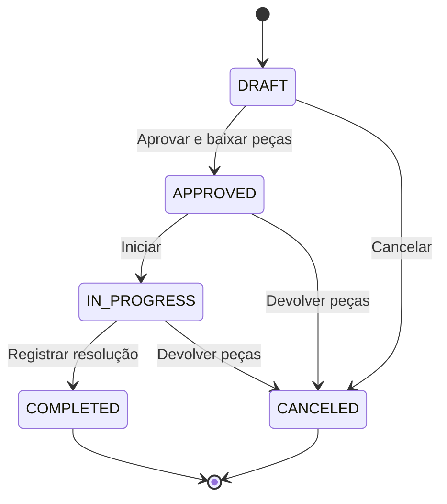

# Arquitetura e decisões

## Organização

Monólito Spring Boot: frontend estático e API compartilham a mesma origem. Isso reduz a instalação a um JAR. HTML/CSS/JavaScript puro evita uma etapa de build de frontend para o usuário final. H2 em arquivo dispensa um servidor de banco separado.

O controller traduz HTTP; o service aplica regras e transações; o repository executa SQL parametrizado. Records modelam entradas e respostas. `ApiErrors` transforma erros esperados em 400/404/409. O filtro local limita escritas vindas de outra origem e define cabeçalhos de segurança. Não substitui autenticação.

## Relacionamentos

Um cliente possui equipamentos; um equipamento recebe ordens; cada ordem possui itens e eventos. Um item pode apontar para uma peça ou representar mão de obra. Movimentações ligam peças a ordens quando existe baixa/devolução. O preço de cada item é uma fotografia do orçamento.



## Integridade e concorrência

1. A transação bloqueia a ordem antes de alterar itens ou status.
2. A aprovação agrega quantidades por peça, inclusive linhas repetidas.
3. Peças são bloqueadas em ordem crescente de ID, reduzindo risco de deadlock.
4. Saldo insuficiente lança erro e reverte toda a transação, incluindo eventos e baixas anteriores.
5. Estado final bloqueia repetição, impedindo a mesma baixa ou devolução duas vezes.

`BigDecimal` e `DECIMAL(12,2)` evitam cálculos monetários em ponto flutuante. SQL usa parâmetros vinculados. A interface escapa texto antes de montar HTML; CSP restringe scripts à própria origem. CSV neutraliza conteúdo interpretável como fórmula.

## API

Prefixo `/api`. JSON em escritas. IDs inválidos retornam 404; validação 400; conflito de negócio/duplicidade 409; criação 201.

| Método | Caminho | Operação |
|---|---|---|
| GET | /health | Disponibilidade |
| GET/POST | /customers | Listar/criar cliente |
| GET/POST | /assets | Listar/criar equipamento |
| GET/POST | /parts | Listar/criar peça |
| POST | /parts/{id}/restock | Repor estoque |
| GET | /parts/{id}/movements | Movimentações |
| GET/POST | /orders | Buscar/criar ordem |
| GET | /orders/{id} | Detalhe, itens e histórico |
| POST | /orders/{id}/items | Adicionar item |
| DELETE | /orders/{id}/items/{itemId} | Remover item do rascunho |
| POST | /orders/{id}/status | Mudar etapa |
| GET | /orders.csv | Exportar todas as ordens |
| GET | /dashboard | Indicadores |

Filtros: `/api/orders?status=DRAFT&search=notebook&page=0&size=10`. A página inicia em zero; tamanho máximo 100. Busca textual máxima 140 caracteres.

Exemplos em terminal Bash, com o servidor em execução:

```bash
curl -X POST http://localhost:8083/api/customers -H 'Content-Type: application/json' -d '{"name":"Cliente exemplo","email":"teste@example.com","phone":"11999990000"}'
curl 'http://localhost:8083/api/orders?status=DRAFT&page=0&size=10'
curl -X POST http://localhost:8083/api/orders/1/status -H 'Content-Type: application/json' -d '{"status":"APPROVED","note":"Cliente aprovou o orçamento"}'
```

A última chamada modifica a ordem 1 da demonstração. No PowerShell, prefira `Invoke-RestMethod` com um objeto convertido por `ConvertTo-Json`.

## Limites e evolução

O escopo inclui cadastro/consulta de clientes, equipamentos e peças; não inclui edição/exclusão desses cadastros. Orçamento é editável antes de aprovado. Não há pesquisa paginada de todos os cadastros, agendamento de técnicos, pagamentos, emissão fiscal, login ou auditoria de identidade. Histórico registra ações, mas não identifica usuários.

Próximos passos de produto: autenticação e permissões, migrações com Flyway, PostgreSQL, edição de cadastros e testes de autorização. Eles exigem novos critérios e não são apresentados como implementados.
